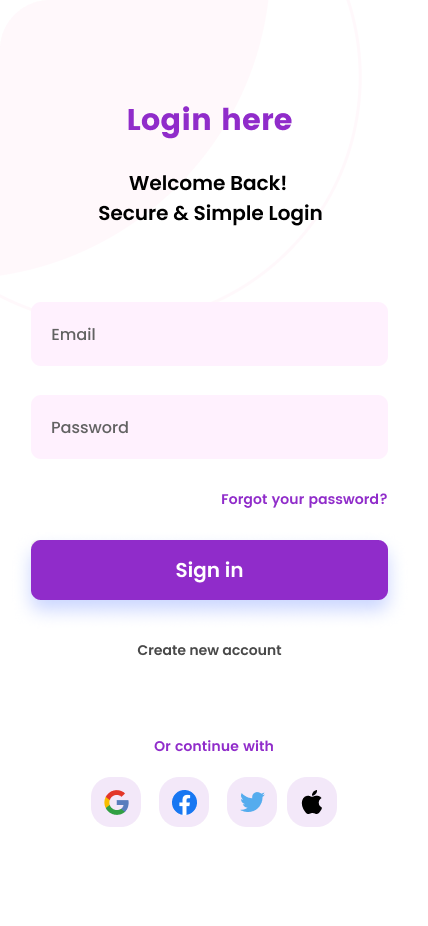
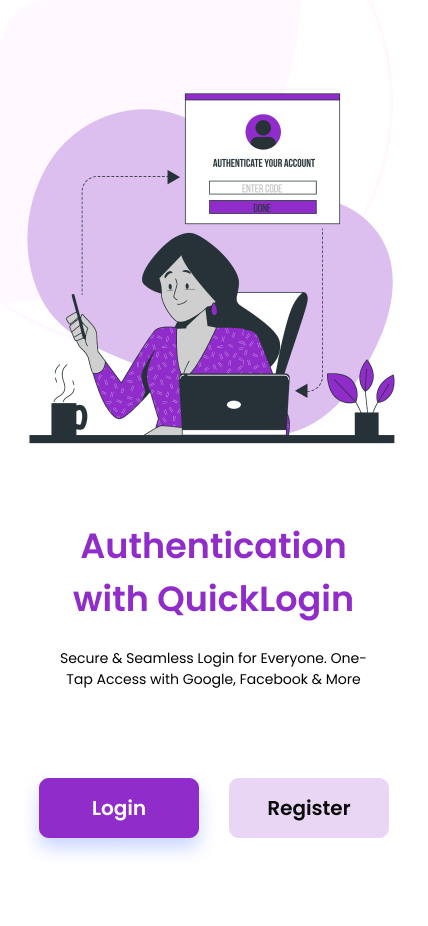
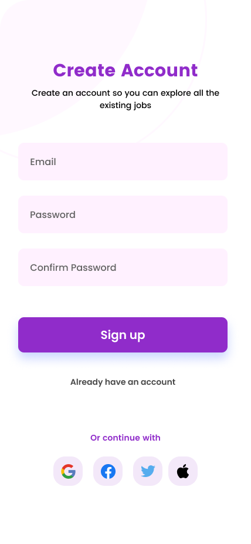

# **📌 QuickLogin - Authentication App (Flutter + Firebase + OAuth)**


A **modern authentication app** built with **Flutter & Firebase**, featuring **Email/Password login, OAuth (Google, Facebook, Twitter), and Forgot Password functionality** with a beautiful UI.

---

## **📌 Screenshots**
| Login Screen | Onboarding Screen | Home Screen |
|-------------|----------------|-------------|
|  |  |   |

---

## **🚀 Features**
✅ **Sign Up & Sign In** with **Email & Password**  
✅ **Google, Facebook, Twitter OAuth Login**  
✅ **Forgot Password with Firebase Reset Email**  
✅ **User Profile: Display Name, Email, Profile Photo, and UID**  
✅ **Secure Authentication with FirebaseAuth**  
✅ **Logout Functionality**  
✅ **Clean, Modern, and Responsive UI**  

---

## **🛠️ Packages Used**
This app is built using the following Flutter dependencies:  

| **Package** | **Usage** |
|------------|-----------|
| [`firebase_auth`](https://pub.dev/packages/firebase_auth) | Firebase Authentication (Email & Password, Google, Facebook, Twitter) |
| [`firebase_core`](https://pub.dev/packages/firebase_core) | Initialize Firebase in Flutter |
| [`google_sign_in`](https://pub.dev/packages/google_sign_in) | Google OAuth Login |
| [`flutter_facebook_auth`](https://pub.dev/packages/flutter_facebook_auth) | Facebook Login |
| [`twitter_login`](https://pub.dev/packages/twitter_login) | Twitter OAuth Login |
| [`fluttertoast`](https://pub.dev/packages/fluttertoast) | Show Toast Messages |
| [`provider`](https://pub.dev/packages/provider) | State Management for Authentication |
| [`shared_preferences`](https://pub.dev/packages/shared_preferences) | Store User Session Locally |
| [`flutter_web_auth_2`](https://pub.dev/packages/flutter_web_auth_2) | OAuth Authentication for Web and Mobile |
| [`http`](https://pub.dev/packages/http) | HTTP Requests for API Integration |
| [`font_awesome_flutter`](https://pub.dev/packages/font_awesome_flutter) | Icons for Social Authentication |

---

## 🎨 Design 

- **Figma Design**: [View Design](https://www.figma.com/design/epOL5k0WgO77Nc3OeRJtco/QuickLogin?node-id=0-1&t=ax5hY1gO3dmvI6XU-1)

---

## **📂 Project Structure**
```
📦 authentication_app/
 ┣ 📂 lib/
 ┃ ┣ 📂 screens/
 ┃ ┃ ┣ forgot_screen.dart
 ┃ ┃ ┣ home_screen.dart
 ┃ ┃ ┣ login_screen.dart
 ┃ ┃ ┗ onboarding_screen.dart
 ┃ ┃ ┣ signup_screen.dart
 ┃ ┣ 📂 utils/
 ┃ ┃ ┣ auth_service.dart
 ┃ ┃ ┣ local_storage_service.dart
 ┃ ┃ ┗ firebase_config.dart
 ┃ ┣ 📂 widgets/
 ┃ ┃ ┣ custom_toast.dart
 ┃ ┗ main.dart
 ┣ 📂 assets/
 ┃ ┗ auth-onboarding.png
 ┃ ┗ avatar.png
 ┣ pubspec.yaml
 ┗ README.md
```

---

## **🚀 Getting Started**
### **1️⃣ Clone the Repository**
```sh
git clone https://github.com/naveddeveloper/quicklogin
cd quicklogin
```

### **2️⃣ Install Dependencies**
```sh
flutter pub get
```

### **3️⃣ Set Up Firebase**
1. **Go to [Firebase Console](https://console.firebase.google.com/)**  
2. **Create a New Project**  
3. **Add Firebase to Your Flutter App**  
4. **Enable Firebase Authentication:**  
   - Email/Password  
   - Google  
   - Facebook  
   - Twitter  
5. **Download `google-services.json` (Android) & `GoogleService-Info.plist` (iOS)**
6. **Place them in the respective `android/app/` & `ios/Runner/` directories.**

### **4️⃣ Run the App**
```sh
flutter run
```

---

## **🔥 Firebase Authentication Setup**
### **Enable Sign-In Methods**
Go to **Firebase Console → Authentication → Sign-in Method** and enable:
✅ Email/Password  
✅ Google  
✅ Facebook (Add App ID & Secret)  
✅ Twitter (Add API Key & Secret)

---

## Feedback 💬

If you have any suggestions, feel free to open an issue or contact me on [Instagram](https://www.instagram.com/naveddeveloper).

## Download the APK
[](https://drive.google.com/uc?id=1X7BdpNzp21c3VH1XsItvIIGA3Zx49eTJ&export=download)


